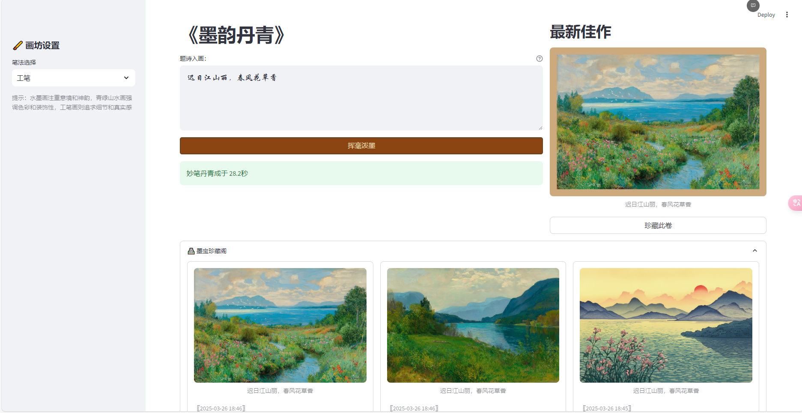

# 🎨 墨韵丹青 —— AI 诗画生成系统

[](https://www.python.org/)
[](https://streamlit.io/)
[](LICENSE)

### 🖌️ 文化数字化实践
- **诗词可视化引擎**：输入任意诗句自动生成高清宣纸画作（支持竖版卷轴/横版册页格式）
- **多格式诗词适配**：精准解析五言绝句的平仄韵律、宋词长短句的意境转折





### 🖥️ 技术特色
- **历史画风再现**：  
  ✓ 宋代水墨：米氏云山笔法参数化建模  
  ✓ 唐代青绿：矿物颜料数字色谱重建  
  ✓ 明清工笔：勾线-晕染工序流程模拟  

### 📚 教育创新
- **教学场景**：  
  ✓ 语文课《江雪》意境可视化教学  
  ✓ 美术课数字水墨技法临摹  
  ✓ 信息课传统文化数据库构建 

## 🛠️ 技术架构

```mermaid
graph TD
    A[用户输入诗句] --> B(Jieba意象解析)
    B --> C{风格矩阵}
    C --> D[水墨渲染引擎]
    C --> E[青绿设色引擎]
    C --> F[工笔勾线引擎]
    D/E/F --> G[通义万相AI]
    G --> H[数字装裱系统]
    H --> I[输出高清卷轴]
